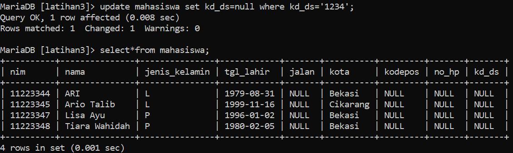
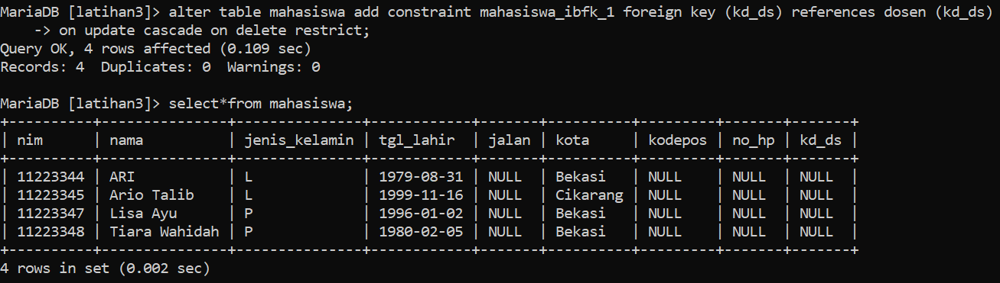
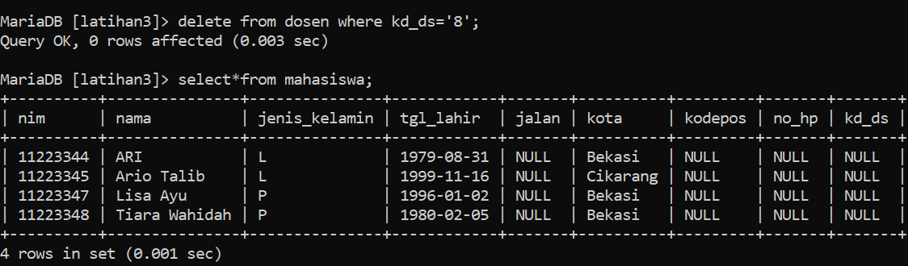

## **Tugas Praktikum**

### !. Lakukan penambahan data pada table mahasiswa dengan mengisi kd_ds yang belum ada pada data dosen

### 2. Hapus satu record data pada table dosen yang telah dirujuk pada tabel mahasiswa

### 3. Ubah mode menjadi ON UPDATE CASCADE ON DELETE RESTRICT

### 4. Lakukan perubahan data pada table dosen kd_ds

### 5. Lakukan penghapusan data pada table dosen

### 6. Ubah mode menjadi ON UPDATE CASCADE ON DELETE SET NULL

###  7. Lakukan penghapusan data pada table dosen

## Evaluasi dan Pertanyaan

### 1. Apa bedanya penggunaan RESTRICT dan penggunaan CASCADE
