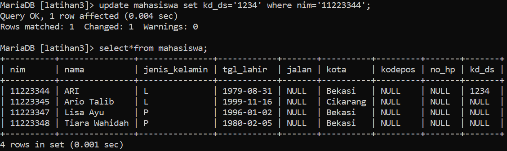
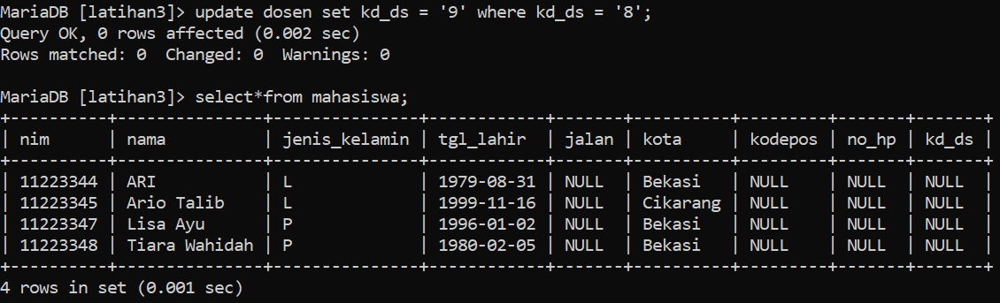

## **Tugas Praktikum**

### !. Lakukan penambahan data pada table mahasiswa dengan mengisi kd_ds yang belum ada pada data dosen

### 2. Hapus satu record data pada table dosen yang telah dirujuk pada tabel mahasiswa

### 3. Ubah mode menjadi ON UPDATE CASCADE ON DELETE RESTRICT

### 4. Lakukan perubahan data pada table dosen kd_ds

### 5. Lakukan penghapusan data pada table dosen

### 6. Ubah mode menjadi ON UPDATE CASCADE ON DELETE SET NULL

###  7. Lakukan penghapusan data pada table dosen

## Evaluasi dan Pertanyaan

### 1. Apa bedanya penggunaan RESTRICT dan penggunaan CASCADE

Penggunaan RESTRICT dan CASCADE adalah dua opsi yang tersedia dalam basis data untuk mengatur tindakan yang diambil terkait integritas referensial saat terjadi perubahan atau penghapusan data dalam tabel yang memiliki hubungan referensial dengan tabel lain. Berikut adalah perbedaan antara keduanya:

RESTRICT: Ketika opsi RESTRICT digunakan, itu berarti basis data akan menghentikan operasi yang akan melarang integritas referensial. Jika ada hubungan referensial antara dua tabel dan Anda mencoba menghapus atau memodifikasi data yang akan melanggar hubungan referensial tersebut, operasi tersebut akan gagal dan menghasilkan pesan kesalahan. Dalam konteks penghapusan data, jika ada entri yang dikaitkan dengan entri lain dalam tabel yang berhubungan, pemusnahan akan dihentikan.

CASCADE: Pada saat menggunakan op